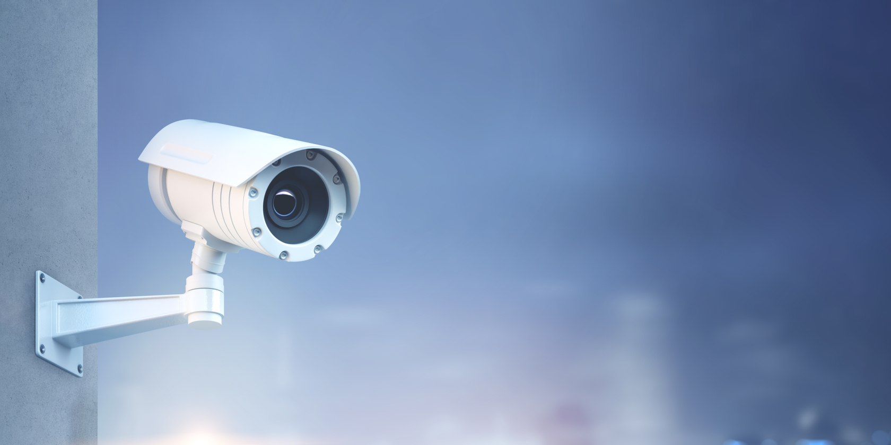
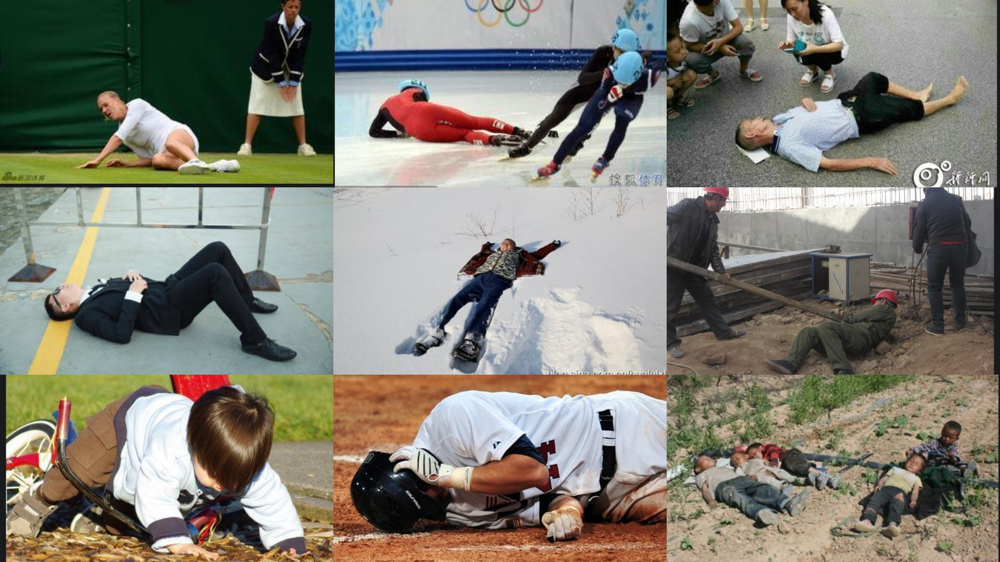

# Human Fall Monitor



## Описание

Проект посвящён задаче компьютерного зрения: **детекция людей в состоянии падения** на изображениях и видео.  
Разработанная модель автоматически выявляет случаи падения и может быть использована:

- в системах видеонаблюдения,  
- в "умных домах",  
- в медицинских приложениях для мониторинга пожилых людей.  

Нейросеть может служить **помощником операторов камер**, отправляя сигнал о человеке, который, возможно, потерял сознание.  
Использование такого инструмента позволит:  

- оперативно спасать человеческие жизни,  
- снизить нагрузку на операторов,  
- уменьшить число сотрудников, необходимых для мониторинга,  
- оптимизировать расходы организаций.

## Данные

Изображения, использованные в данном проекте, были вручную размечены с помощью инструмента CVAT, что позволило привести данные к формату, необходимому для обучения модели нейросети. Помимо изображений, содержащих объекты детектируемого класса (упавших людей), в набор данных также включались фотографии без таких объектов — люди в обычных позах и кадры, не содержащие людей. Это помогло модели лучше различать фон и повышало точность детекции. 

На этапе обучения к изображениям применялись мягкие аугментации, включая небольшие повороты, смещение объектов, изменения оттенка, контрастности и яркости, а также лёгкие искажения перспективы.



## Модель

Для решения задачи использовалась разработанная компанией [Ultralytics](https://github.com/ultralytics/ultralytics) модель YOLOv11s, которая является современной и эффективной моделью для компьютерного зрения и способна работать в реальном времени. 

Обучение проводилось 200 эпох с использованием ранней остановки. Размер входных изображений составил 768 пикселей, а размер батча — 16. Для ускорения обучения использовались предобученные веса. Валидирование проводилось на каждом шаге, а результаты и графики обучения сохранялись каждые 10 эпох. Для задачи детекции упавших людей нам важно максимальное покрытие, поэтому веса box=4.0 и cls=0.8 были выбраны, чтобы модель чаще находила упавших людей и не пропускала их на кадре.

```python
results = model.train(
    data="./dataset/data.yaml",
    epochs=200,
    patience=30,
    imgsz=768,
    batch=16,
    device='cuda',
    verbose=False,
    pretrained=True,
    val=True,
    save_period=10,
    plots=True,

    augment=True,
    mosaic=0.25,
    mixup=0.0,
    degrees=5.0,
    translate=0.20,
    hsv_h=0.015,
    hsv_s=0.3,
    hsv_v=0.4,
    shear=2.0,

    box=4.0, 
    cls=0.8
)
```


## Результат

### Основные метрики
| Метрика        | Значение |
|----------------|----------|
| Precision      | **0.837** |
| Recall         | **0.751** |
| mAP@0.5        | **0.818** |
| mAP@0.5:0.95   | **0.505** |

- **Precision:** модель в ~84% случаев правильно определяет падение, не выдавая ложных срабатываний. 
- **Recall:** модель находит ~75% всех падений в тестовой выборке.  
- **mAP@0.5:** качество детекции на уровне современных решений.  
- **mAP@0.5–0.95:** модель остаётся устойчивой даже при строгих критериях.

Ложные срабатывания чаще возникают, когда человек **сидит или сильно наклоняется**, что похоже на падение. Пропуски чаще всего связаны с **маленьким размером человека в кадре** или **шумным фоном**. Качество детекции можно улучшить за счёт увеличения набора данных и более точной подстройки модели под конкретную задачу.

---

### Визуализация работы на тестовых видео

