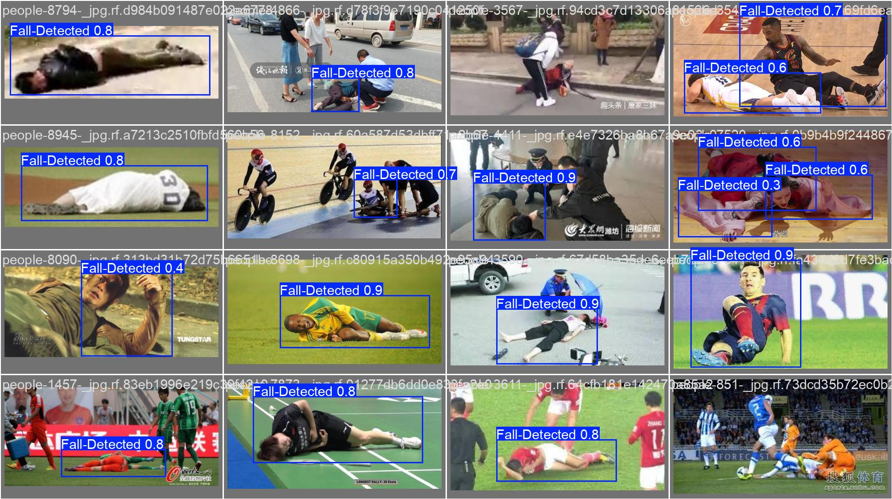
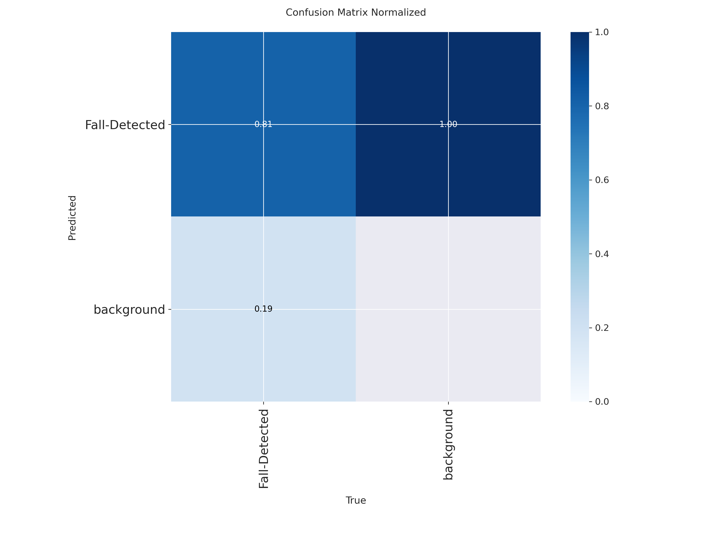

# Human Fall Monitor

## Описание

Проект посвящён задаче компьютерного зрения: **детекция людей в состоянии падения** на изображениях и видео.  
Разработанная модель автоматически выявляет случаи падения и может быть использована:

- в системах видеонаблюдения,  
- в "умных домах",  
- в медицинских приложениях для мониторинга пожилых людей.  

Нейросеть может служить **помощником операторов камер**, отправляя сигнал о человеке, который, возможно, потерял сознание.  
Использование такого инструмента позволит:  

- оперативно спасать человеческие жизни,  
- снизить нагрузку на операторов,  
- уменьшить число сотрудников, необходимых для мониторинга,  
- оптимизировать расходы организаций.

## Данные

Изображения, использованные в данном проекте, были вручную размечены с использованием инструмента CVAT, что позволило эффективно привести данные в тот формат, который ожидает используемая модель нейросети. Помимо изображений, содержищих непосрественно объекты детектируемого класса (упавших людей), были использованы и фотографии, которые такие объекты не содержали (люди в других позах и фотографии, не содержащие людей), что позволило модели лучше детектировать фон фотографий. К изображениям на этапе обучения применялись мягкие аугментации (небольшие повороты, изменения оттенка, контрастности, яркости).

## Модель

Для решения задачи использовалась разработанная компанией [Ultralytics](https://github.com/ultralytics/ultralytics) модель YOLOv11s, которая считается мощным инструментом для решения множества задач компьютерного зрения. Обучение запускалось на 200 эпох с функцией ранней остановки. 

## Результат

### Основные метрики
| Метрика        | Значение |
|----------------|----------|
| Precision      | **0.837** |
| Recall         | **0.751** |
| mAP@0.5        | **0.818** |
| mAP@0.5:0.95   | **0.505** |

- **Precision (0.837):** модель в ~84% случаев правильно определяет падение, не выдавая ложных срабатываний. 
- **Recall (0.751):** модель находит ~75% всех падений в тестовой выборке.  
- **mAP@0.5 (0.818):** качество детекции на уровне современных решений.  
- **mAP@0.5–0.95 (0.505):** модель остаётся устойчивой даже при строгих критериях.  

---

### Визуализации
- Пример работы модели на тестовых видео:  
  

- Примеры валидации (true positive, false positive, false negative):  
    
  

---

### Ошибки модели
- Ложные срабатывания чаще возникают, когда человек **сидит или сильно наклоняется**, что похоже на падение. 
- Пропуски чаще всего связаны с **маленьким размером человека в кадре** или **шумным фоном**.
